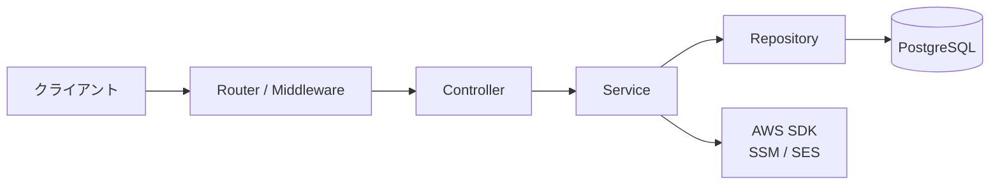
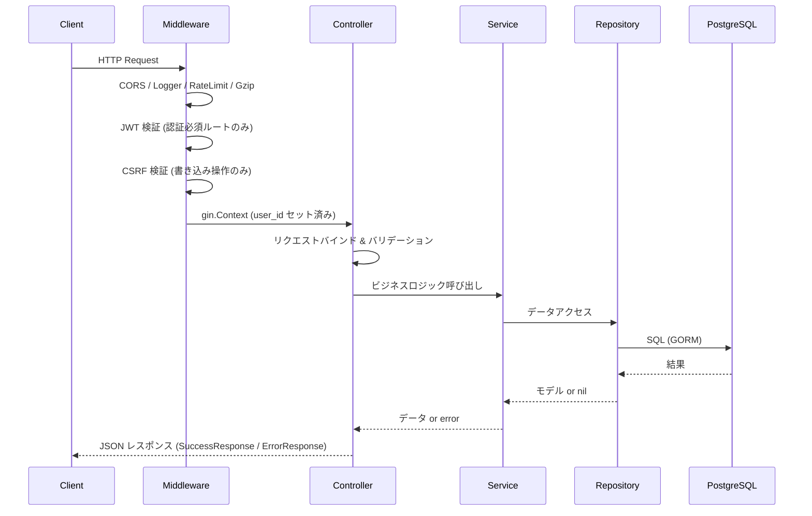
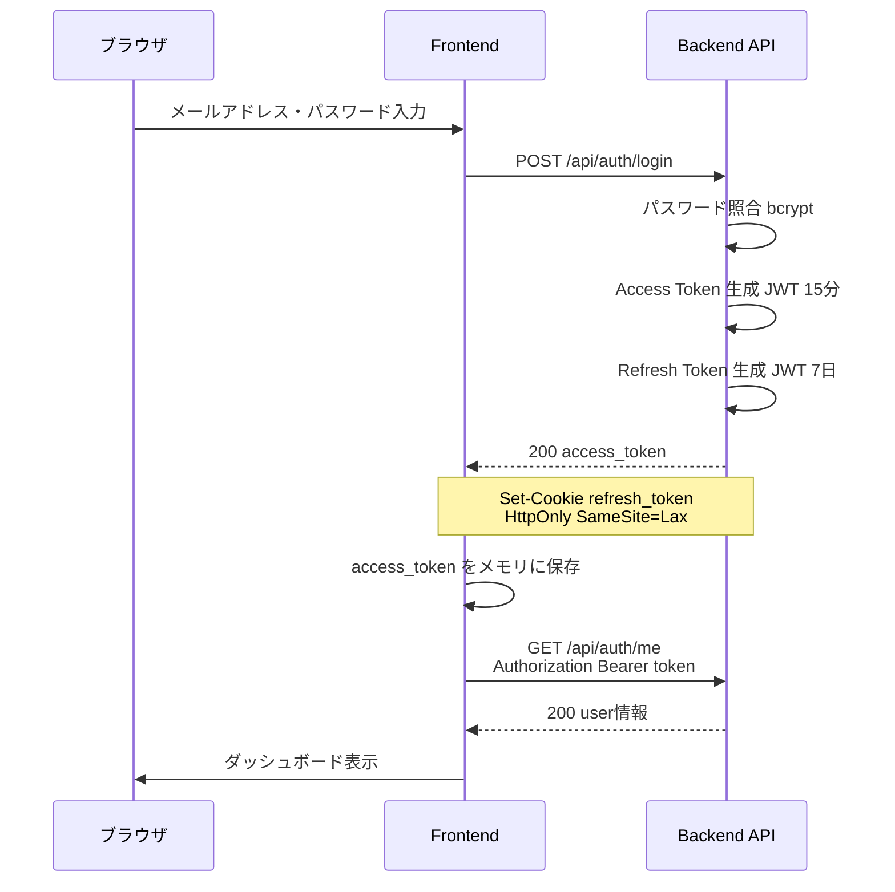
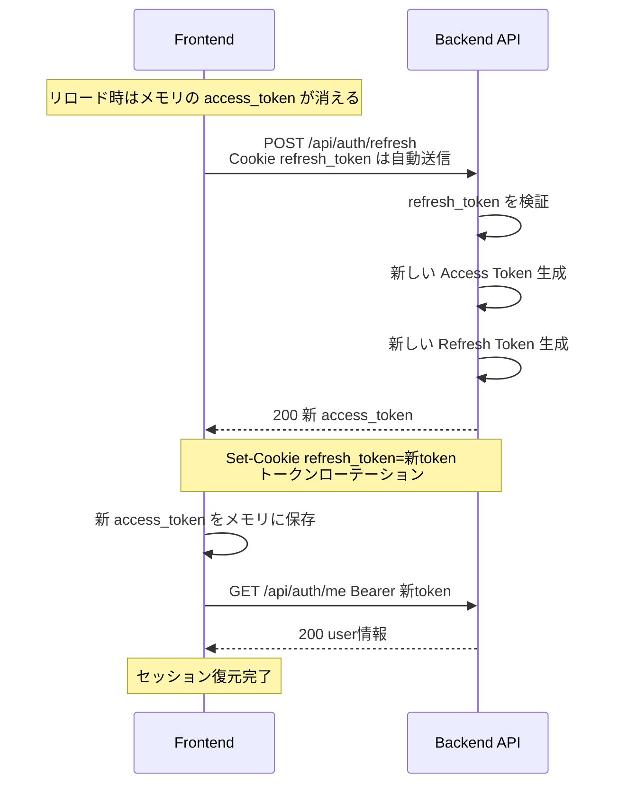
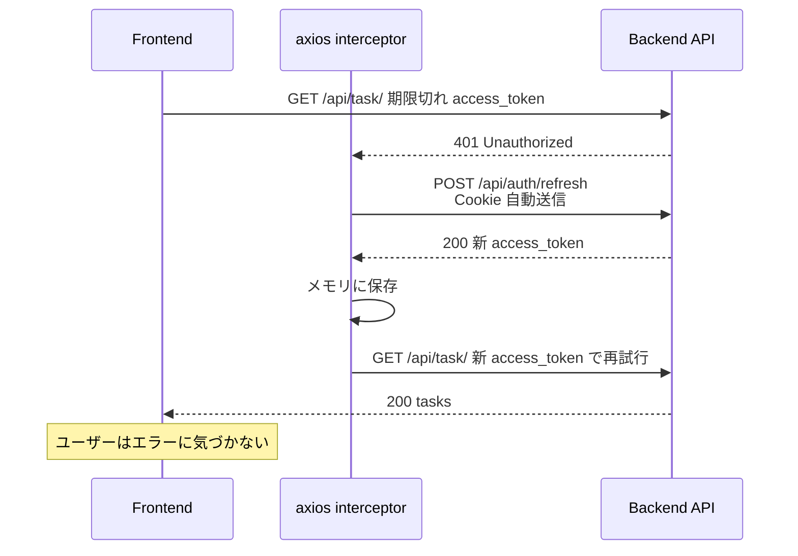
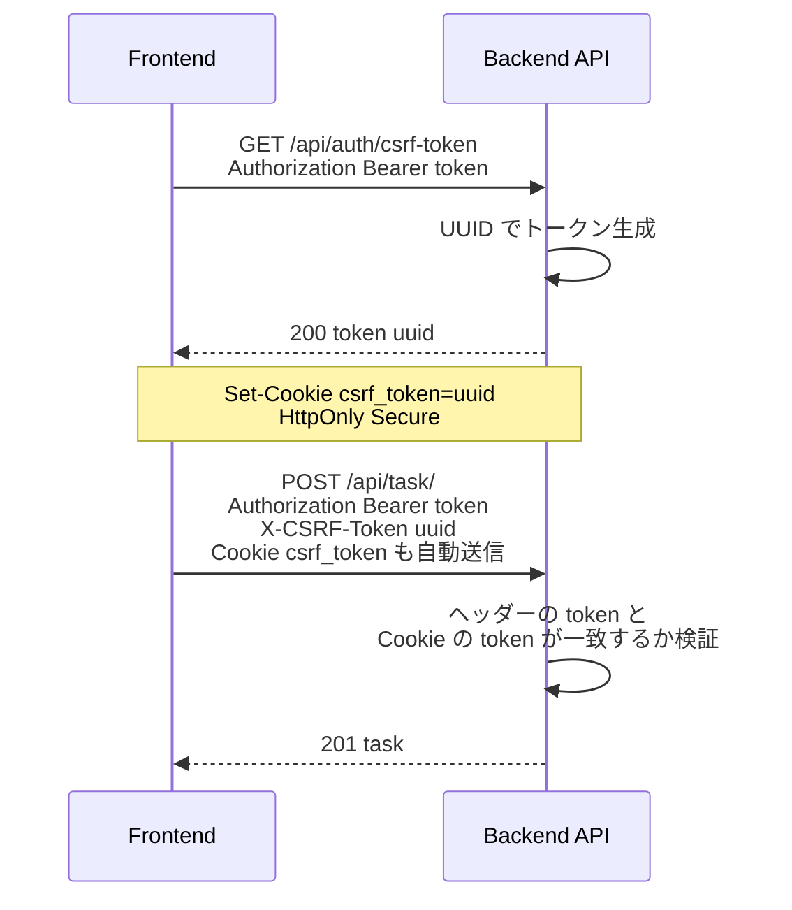
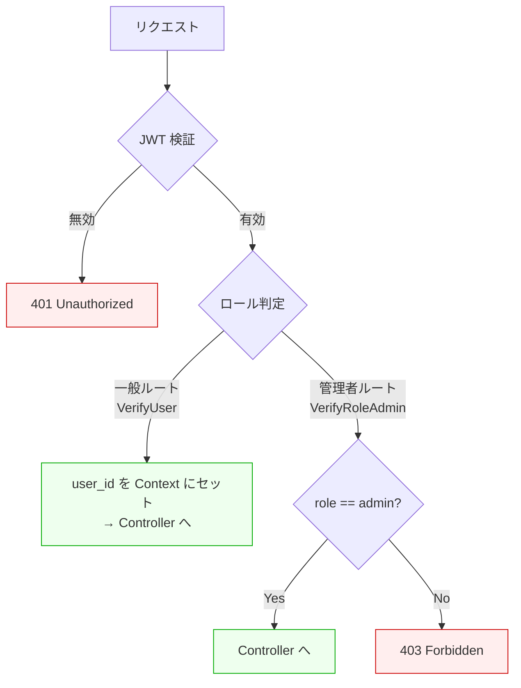

# Gin Todo API
- タスク管理API（Go + Gin + React）のフルスタックアプリケーション

## 目的
- Go言語の基礎的な実装力の向上

## 技術スタック

### Backend(実装済み)
- Go
- Gin Web Framework
- PostgreSQL
- GORM (ORM)
- golang-migrate (DBマイグレーション)
- JWT認証 (Access Token + Refresh Token)
- WebSocket (リアルタイム通知)
- AWS SDK v2 (SSM ParameterStore / SES)
- Swagger / OpenAPI (swaggo)
- Air (ホットリロード)

### Frontend(未実装 / 使用予定の技術スタック)
- React
- TypeScript
- Vite
- React Router
- Context API (状態管理)
- Tailwind CSS

### Infra(未実装 / バックエンドに必要なリソースを一部設定)
- AWS
  - VPC
  - Subnet
  - Internet Gateway
  - NAT Instance
  - Route53
  - CloudFront
    - VPC Origin
  - ALB
  - S3
  - ECS
  - RDS for PostgreSQL
  - SSM Parameter Store
  - CDK with TypeScript

### CI/CD(未実装)
- Github Actions

---

## アーキテクチャ

### バックエンドのレイヤー構成



### リクエスト処理フロー



---

## 認証・認可

### ログインフロー



### トークンリフレッシュ (ページリロード時 / 401 発生時)



### 401 発生時の自動リトライ (axios interceptor)



### CSRF トークンフロー (タスク書き込み操作)



### 認可 (ロールベースアクセス制御)



### トークン管理まとめ

| トークン | 保存場所 | 有効期限 | 用途 |
|----------|----------|----------|------|
| Access Token | フロントのメモリ (変数) | 15分 | API リクエストの認証 |
| Refresh Token | HttpOnly Cookie | 7日 | Access Token の更新 |
| CSRF Token | ヘッダー + Cookie (ダブルサブミット) | 24時間 | 書き込み操作の保護 |

---

## ローカル開発

```bash
# 1. DB / メールサーバー起動
docker compose up -d

# 2. バックエンド起動
cd backend
air                    # ホットリロード

# 3. フロントエンド起動
cd frontend
pnpm dev               # http://localhost:3000
```

| サービス | URL |
|----------|-----|
| Frontend | http://localhost:3000 |
| Backend API | http://localhost:8080 |
| Swagger UI | http://localhost:8080/swagger/index.html |
| Adminer (DB) | http://localhost:9090 |
| SES Local | http://localhost:8005 |
